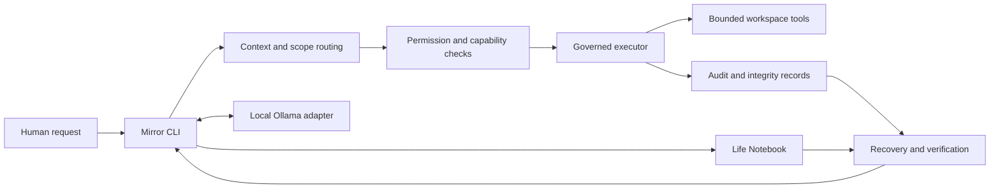

# HumanOS

**A local-first AI runtime for durable context, governed tools, and evidence-backed recovery.**

HumanOS explores how an AI system can remain useful across work without making model output authoritative or exposing unrelated personal records. Its public Runtime 0.1 is an early terminal application and engineering project, not a finished consumer product.

[Get started](docs/getting-started.md) · [Documentation map](docs/index.md) · [Architecture](docs/architecture.md) · [Security and privacy](docs/security-and-privacy.md) · [Limitations](docs/limitations.md)

## At a glance

- **Runtime:** Python CLI with a terminal-facing Mirror interface.
- **Inference:** local Ollama is the implemented provider; the model protocol is an adapter boundary, not evidence of hosted-provider support.
- **State:** SQLite-backed Notebook transactions with readable projections, integrity checks, and explicit recovery states.
- **Tools:** narrow, validated capabilities with request-scoped permissions and human approval for governed writes.
- **Engineering:** a standard-library `unittest` suite, targeted failure/recovery tests, and CI workflows. Test totals vary by commit.
- **Status:** active early-stage runtime. Local browser pairing and live multi-agent execution are not claimed by a repository test pass.

## Why HumanOS exists

AI assistants can lose context, blur proposals with verified facts, and hide what happened when an operation is interrupted. HumanOS treats the model as one replaceable component. The human remains the authority; permissions, durable state, tool execution, and recovery are explicit and inspectable.

## Architecture



The Mirror coordinates the interaction; it does not own human decisions. The Context Registry helps select relevant work context. Capabilities constrain available actions. The Notebook stores durable session and transaction evidence. Recovery reports uncertain outcomes for inspection instead of silently repeating consequential work.

## What is implemented

- Terminal Mirror with local queries for session, Notebook, time, and capability state.
- Local Ollama inference behind a narrow model interface.
- Durable transcript, task, transaction, and recovery records with readable projections.
- Context and workstream routing with explicit ambiguity handling.
- Governed file operations with path checks, request scope, approval gates, and no silent overwrite.
- Recovery and integrity validation for interrupted work and derived Notebook projections.
- A generic public mastery engine and catalog with synthetic examples and tests.
- An opt-in JSON tool broker for bounded agent proposals. It validates registered capabilities and authorization envelopes; it is not a general autonomous scheduler or sandbox for arbitrary worker code.
- A governed Browser Bridge implementation. Owner-local extension pairing and end-to-end browser operation require separate local verification.

Specifications, research, and candidate work also live in the repository. A document describing a capability does not prove that capability is implemented or deployed; use the code, tests, and evidence for that distinction.

## What this project demonstrates

| Area | Evidence in this repository |
|---|---|
| AI systems architecture | Separate Mirror, model adapter, context routing, capabilities, executor, and durable state. |
| Agent orchestration | A bounded broker for registered agent proposals, mediated messages, and fixed tools; no arbitrary-code workers or autonomous scheduler. |
| Privacy and security engineering | Request-scoped access, explicit authorization, data minimization, local-first defaults, and documented threat limits. |
| Integrity and data lifecycle | Hash-based consistency checks, append-oriented evidence, recovery states, and restart-focused tests. Integrity checks are not protection from an attacker controlling the host and keys. |
| Human-in-the-loop governance | Model output remains a proposal; consequential actions require explicit scope and approval. |
| Auditability and evaluation | Structured action outcomes, provenance, regression tests, and a clear distinction between local, CI, and provider evidence. |
| Python, APIs, and storage | Python runtime modules, JSON contracts, SQLite persistence, and local model/tool adapters. |
| Testing and SDLC | Standard-library unit tests, failure-path coverage, bounded work orders, and CI workflows. |
| Portability design | Replaceable interfaces and documented boundaries; current inference remains local Ollama only. |
| Technical communication | Public architecture, limitations, security assumptions, and implementation status are documented separately. |

These are examples of engineering work in this repository, not claims of production adoption, customer scale, or a deployed multi-provider service.

## Run locally

Requirements: Python 3.9 or newer, a local Ollama installation with an available model, and a dedicated workspace containing only files you authorize HumanOS to access.

```bash
python3 server.py
```

Run the supported test suite from the repository root:

```bash
python3 -m unittest discover -s tests -v
```

See [Getting started](docs/getting-started.md) for safe setup guidance. Live local-model and browser checks are separate from unit tests and are not implied by a passing CI run.

## Privacy boundary

This public repository contains generalized software, architecture, documentation, and synthetic examples. Real learner curricula, grades, progress, assessments, evidence, personal skill maps, job applications, employer-specific preparation, recruiter records, compensation notes, private conversations, and personal operational data belong in private systems. Do not commit transcripts, credentials, client records, or private filesystem details.

The runtime is local-first, but local execution alone is not a security guarantee. It is not a general operating-system sandbox, does not claim protection from a compromised host, and does not automatically capture external ChatGPT or Codex conversations.

## Repository guide

| Path | Contents |
|---|---|
| `server.py`, `server_core.py`, `humanos.py` | Runtime entry points and coordination. |
| `notebook.py`, `conversation_ledger.py`, `recovery_ledger.py` | Durable state, capture, and recovery. |
| `capabilities.py`, `permissions.py`, `work_executor.py` | Tool contracts and governed execution. |
| `context_registry.py`, `context_runtime.py` | Public context metadata and deterministic routing. |
| `learning/` | Generic mastery engine, catalog, and synthetic public fixtures. |
| `swarm.py`, `swarm_runtime.py`, `SWARM.md` | Optional bounded tool broker and its limits. |
| `browser_bridge.py`, `browser-extension/` | Governed browser integration code; local pairing is a separate check. |
| `docs/` | Architecture, security, testing, research, work orders, and roadmap. |
| `tests/` | Unit and integration-style regression tests using isolated temporary state. |

## Limitations and roadmap

Runtime 0.1 is terminal-first and local-Ollama-only. It is not a general shell agent, a hardened multi-user boundary, or a finished desktop product. Hosted providers, multi-device conflict resolution, a desktop interface, and broader deployment controls require future design and implementation. The [roadmap](docs/roadmap.md) is directional; planned items are not current capabilities.

## Development

Start with the [documentation map](docs/index.md), [testing and evidence guidance](docs/testing-and-evidence.md), and [contribution process](docs/contributing.md). Keep changes bounded, use synthetic public fixtures, run the relevant tests, and state what was implemented versus specified or planned.
